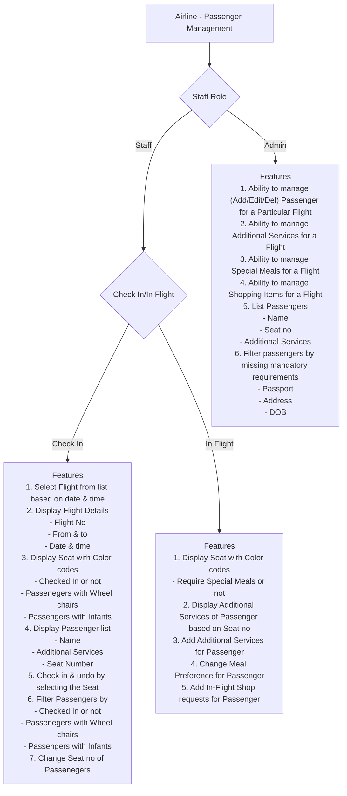

```mermaid
flowchart TD
    A[Airline - Passenger Management] --> B{Staff Role}
    B -->|Staff| C{Check In/In Flight}
	C -->|Check In| E["`
        Features
            1. Select Flight from list based on date & time
            2. Display Flight Details
                - Flight No
                - From & to
                - Date & time
            3. Display Seat with Color codes
                - Checked In or not
                - Passenegers with Wheel chairs
                - Passengers with Infants
            4. Display Passenger list
                - Name
                - Additional Services
                - Seat Number
            5. Check in & undo by selecting the Seat
            6. Filter Passengers by
                - Checked In or not
                - Passenegers with Wheel chairs
                - Passengers with Infants
            7. Change Seat no of Passenegers
    `"]
    C -->|In Flight| F["`
        Features
            1. Display Seat with Color codes
                - Require Special Meals or not
            2. Display Additional Services of Passenger based on Seat no
            3. Add Additional Services for Passenger
            4. Change Meal Preference for Passenger
            5. Add In-Flight Shop requests for Passenger
    `"]
    B -->|Admin| D["`
        Features
            1. Ability to manage (Add/Edit/Del) Passenger for a Particular Flight
            2. Ability to manage Additional Services for a Flight
            3. Ability to manage Special Meals for a Flight
            4. Ability to manage Shopping Items for a Flight
            5. List Passengers
                - Name
                - Seat no
                - Additional Services
            6. Filter passengers by missing mandatory requirements
                - Passport
                - Address
                - DOB
    `"]
```
